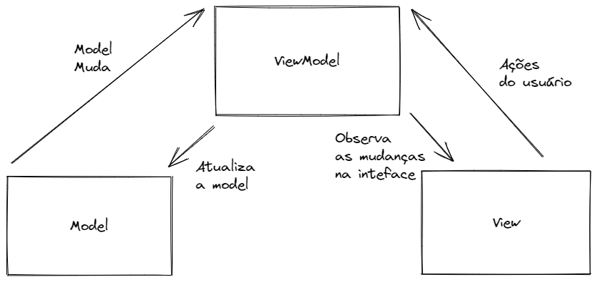

<h1 align="center">LiveList</h1>

<p align="center">
  <a href="https://opensource.org/licenses/Apache-2.0"></a>
  <a href="https://android-arsenal.com/api?level=21"></a>
  <br>
  <a href="https://wa.me/+5541991965121"></a>
  <a href="https://www.linkedin.com/in/kaiqueocanha/"></a>
  <a href="mailto:kaique@ocanha.com"></a>
</p>

<p align="center">  

⭐ Esse é um projeto para demonstrar meu conhecimento técnico no desenvolvimento Android nativo com Kotlin. Mais informações técnicas abaixo.

🎥 Aplicativo que mostra uma listagem das aulas de Android do canal do youtube Kaique Ocanha de forma cronológica, com busca, filtros e sistema de favoritos.

</p>

</br>

<p float="left" align="center">
  
  
  
</p>

## Download
<a href='https://play.google.com/store/apps/details?id=com.kiloo.subwaysurf&pcampaignid=pcampaignidMKT-Other-global-all-co-prtnr-py-PartBadge-Mar2515-1'></a>

Ou faça o download da <a href="https://github.com/kaiqueocanha/readme-template-android-app/blob/main/apk/app-debug.apk?raw=true">APK diretamente</a>. Você pode ver <a href="https://www.google.com/search?q=como+instalar+um+apk+no+android">aqui</a> como instalar uma APK no seu aparelho android.

## Tecnologias usadas e bibliotecas de código aberto

- Minimum SDK level 21
- [Linguagem Kotlin](https://kotlinlang.org/)

- Jetpack
  - Lifecycle: Observe os ciclos de vida do Android e manipule os estados da interface do usuário após as alterações do ciclo de vida.
  - ViewModel: Gerencia o detentor de dados relacionados à interface do usuário e o ciclo de vida. Permite que os dados sobrevivam a alterações de configuração, como rotações de tela.
  - ViewBinding: Liga os componentes do XML no Kotlin através de uma classe que garante segurança de tipo e outras vantagens.
  - Room: Biblioteca de abstração do banco de dados SQLite que garante segurança em tempo de compilação e facilidade de uso.
  - Custom Views: View customizadas feitas do zero usando XML.
  - [...]

- Arquitetura
  - MVVM (View - ViewModel - Model)
  - Comunicação da ViewModel com a View através de LiveData
  - Comunicação da ViewModel com a Model através de Kotlin Flow
  - Repositories para abstração da comunidação com a camada de dados.
  
- Bibliotecas
  - [Retrofit2 & OkHttp3](https://github.com/square/retrofit): Para realizar requisições seguindo o padrão HTTP.
  - [Glide](https://github.com/bumptech/glide): Para carregamento de imagens e cacheamento das mesmas.
  - [Timber](https://github.com/JakeWharton/timber): Para registros de logs mais amigáveis que facilitam o debug.
  - [...]

## Arquitetura
**LiveList** utiliza a arquitetura MVVM e o padrão de Repositories, que segue as [recomendações oficiais do Google](https://developer.android.com/topic/architecture).
</br></br>

<br>

## API de terceiros

LiveList usa a [PokeAPI](https://pokeapi.co/) para suas chamadas REST<br>
PokeAPI disponibiliza gratuitamente uma API REST completa com a listagem dos pokemons.

## Features

### Listagem de lives


Listagem cronológica de lives com filtragem por data, categoria e tags. Busca por título e descrição da live. Carregamento das imagens de forma dinâmica da web. Layout de card criado com CardView e ConstraintLayout.

### Sistema de favoritos


Texto de Exemplo. Listagem cronológica de lives com filtragem por data, categoria e tags. Busca por título e descrição da live. Carregamento das imagens de forma dinâmica da web. Layout de card criado com CardView e ConstraintLayout.

# Licença
```xml

Licensed under the Apache License, Version 2.0 (the "License");
you may not use this file except in compliance with the License.
You may obtain a copy of the License at

   http://www.apache.org/licenses/LICENSE-2.0

Unless required by applicable law or agreed to in writing, software
distributed under the License is distributed on an "AS IS" BASIS,
WITHOUT WARRANTIES OR CONDITIONS OF ANY KIND, either express or implied.
See the License for the specific language governing permissions and
limitations under the License.
```

Google Play e o logótipo do Google Play são marcas comerciais da Google LLC.
